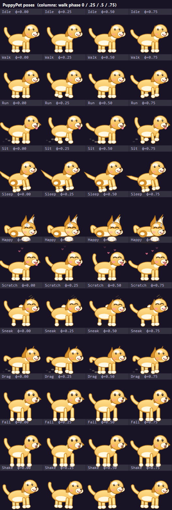

# 🐶 小黄狗 · Windows 桌面宠物

一只治愈系的小黄狗，常驻在你的 Windows 桌面上：自己跑来跑去、坐下、打盹；鼠标移上去会跟你互动（摸头 / 挠痒），
鼠标挪开大约 10 秒，它就**偷偷溜走**去别处玩；按住左键还能把它拎起来，松手它会掉下去、落地抖抖毛。

**纯 C# + WinForms 手写矢量绘制，零第三方依赖、零图片素材、单文件 66 KB，内存约 36~40 MB。**



> 上图为程序自己渲染的姿态总览（`PuppyPetTests.exe --snapshot` 生成），11 种姿态 × 4 个动画相位。

## 特性

| 行为 | 说明 |
|---|---|
| 🏃 自己玩耍 | 在屏幕工作区内随机漫步、奔跑、坐下、打盹；长时间没人理还会撒欢跑到别处 |
| 🖐️ 摸头 | 鼠标移到小狗身上，立刻变成眯眼笑 + 摇尾巴 + 冒爱心 |
| 🐾 挠痒痒 | 持续抚摸时会在「摸头」和「挠耳朵」之间来回切换 |
| 🥷 偷偷跑掉 | 鼠标移开约 **10 秒**后，它会压低身子快步溜到远处，装作没被你摸过 |
| ✋ 拎起来 | 左键按住可以把它拖到任意位置，松手自由落体，落地抖一抖毛 |
| 👆 戳一下 | 单击（不拖动）会开心地原地跳一下 |
| 🖱️ 不挡鼠标 | 透明像素处鼠标事件直接穿透，不影响点桌面图标和窗口 |
| 🪟 多显示器 | 在主屏工作区内活动，总在最前（可关） |
| 📌 托盘菜单 | 右键小狗或托盘图标：显示/隐藏、暂停、指定动作、大小、置顶、开机自启、退出 |
| 💾 记忆设置 | 大小、置顶、暂停状态存在 `%APPDATA%\PuppyPet\config.ini` |
| 🐾 只跑一只 | 单实例互斥，重复双击只是把它叫醒 |

## 快速开始

**方式一：直接运行（推荐）**

下载仓库里的 [`dist/PuppyPet.exe`](dist/PuppyPet.exe)，双击即可。系统自带 .NET Framework 4.x，无需安装任何东西。

**方式二：自己编译（同样不需要装 SDK）**

```
双击 build.cmd            :: Windows 上直接双击
```

或：

```bash
./build.sh                # WSL / Git Bash
```

编译产物在 `dist/`：

| 文件 | 用途 |
|---|---|
| `dist/PuppyPet.exe` | 桌宠本体（约 66 KB） |
| `dist/PuppyPetTests.exe` | 自测程序（37 项检查 + 姿态图/图标生成） |

## 自测

```cmd
dist\PuppyPetTests.exe                              :: 跑 37 项断言
dist\PuppyPetTests.exe --snapshot docs\poses.png    :: 生成姿态总览图
dist\PuppyPetTests.exe --icon assets\puppy.ico      :: 生成应用图标
```

自测覆盖：初始状态、悬停变开心、摸头/挠痒来回切换、**鼠标移开 10 秒后偷偷溜走**、长时间无人看管时
自己跑动且不越界、拖动→下落→落地→抖毛、点击起跳、卡顿保护、暂停、同种子轨迹可复现、命中测试，
以及 11 种姿态的绘制（覆盖率、不溢出画布、左右转身镜像一致）。

## 交互说明

- **摸头 / 挠痒**：把鼠标移到小狗身上即可，不需要点击。
- **偷偷跑掉**：鼠标离开后 10 秒。想让它留下就再摸一下（计时会重置）。
- **拎起来**：左键按住拖动，松手掉落。
- **菜单**：在狗身上点右键，或点托盘图标。
- **退出**：托盘菜单 →「退出」（小狗没有任务栏按钮，所以只能这样或任务管理器结束进程）。

## 实现要点（为什么这么省）

- **分层窗口逐像素透明**：`WS_EX_LAYERED` + `UpdateLayeredWindow`，直接贴一张 32bpp 预乘 alpha 位图，
  没有颜色键造成的锯齿和白边；窗口只有 132×120。
- **鼠标穿透**：处理 `WM_NCHITTEST`，光标落在透明像素时返回 `HTTRANSPARENT`，所以虽然窗口是矩形，
  但不会挡住底下的图标和窗口。
- **矢量绘制，无素材**：整只狗由圆角矩形、椭圆、贝塞尔曲线拼出来（`src/DogArt.cs`），
  换姿态只是改几个参数，因此仓库里没有任何 PNG/精灵图，exe 只有 66 KB。
- **自适应帧率**：被摸/移动时 30 FPS，待机 15 FPS，睡觉 6 FPS；不播放动画时不重绘。
- **零分配主循环**：画刷、画笔、字体、渐变全部 static 复用，托盘图标只生成一次。
- **行为与渲染分离**：`src/DogBrain.cs` 是纯逻辑状态机（喂时间戳即可复现），所以能在无窗口环境下
  跑完整的行为断言——上面 37 项测试就是这么来的。

## 目录结构

```
puppy-pet/
├── src/
│   ├── DogBrain.cs      # 行为状态机（纯逻辑，可测）：走跑坐睡/互动/溜走/拖拽/物理
│   ├── DogArt.cs        # 小黄狗的 GDI+ 矢量画法（11 种姿态、特效）
│   ├── PetForm.cs       # 分层窗口、主循环、鼠标交互、托盘菜单
│   ├── Config.cs        # config.ini 读写 + 开机自启
│   ├── Program.cs       # 入口（单实例）
│   └── SelfTest.cs      # 自测 + 姿态图 + 图标生成
├── assets/puppy.ico     # 由程序自己画出来的应用图标
├── docs/poses.png       # 姿态总览（生成的）
├── dist/                # 编译产物
├── build.cmd / build.sh # 一键编译
└── run.cmd              # 一键运行
```

## 参考的同类开源工程

本项目的交互设计参考了 GitHub 上几个成熟的桌宠项目，但实现上刻意做得更轻（无素材、无依赖、单文件）：

- [Noelune/liuying-desktop-pet](https://github.com/Noelune/liuying-desktop-pet) —— 轻量、低打扰、关键帧动画的 Windows 桌宠
- [MerZlin/dsh-pet-indesktop](https://github.com/MerZlin/dsh-pet-indesktop) —— 托盘菜单、动画分组、多平台移植思路
- [TonyNa-code/desktop-pet](https://github.com/TonyNa-code/desktop-pet) —— 桌宠行为与状态切换的常见做法

## 常见问题

- **杀毒软件报警**：exe 是自己用系统自带 `csc.exe` 编译的、未签名的小程序，可能被启发式误报。
  可以自己 `build.cmd` 重新编译一份，或把它加白名单。
- **点不到桌面图标**：小狗只在小狗身上接管鼠标，透明区域是穿透的；如果它正好站在图标上，
  把它拎走或等它自己走开。
- **想让它安静**：托盘菜单 →「暂停活动」。
- **多显示器**：目前在主显示器的**工作区**（不含任务栏）内活动。

## License

MIT
